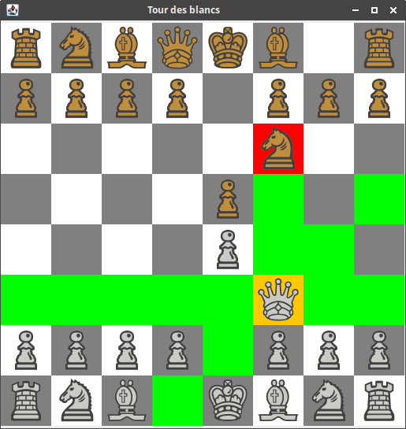

# Chessgame

This was a training project while learning how to draw in java. Execute the *Principal.java* file in order to launch the program.

**A full game can't be played as some moves and constraints haven't been implemented yet**

